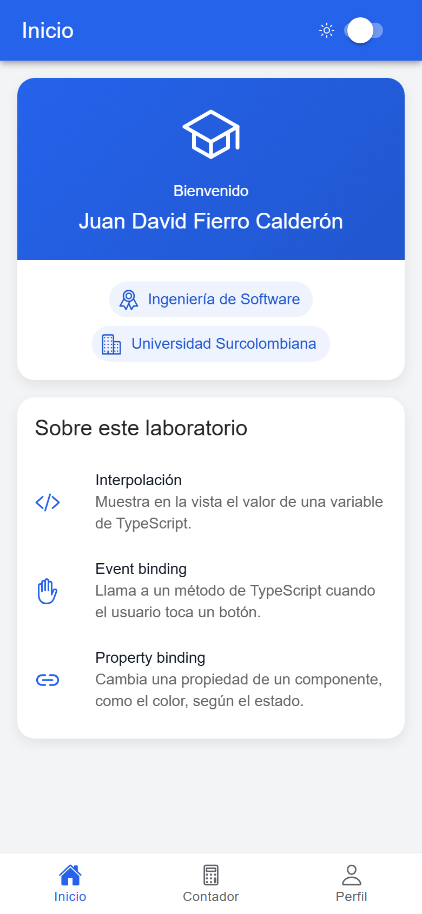
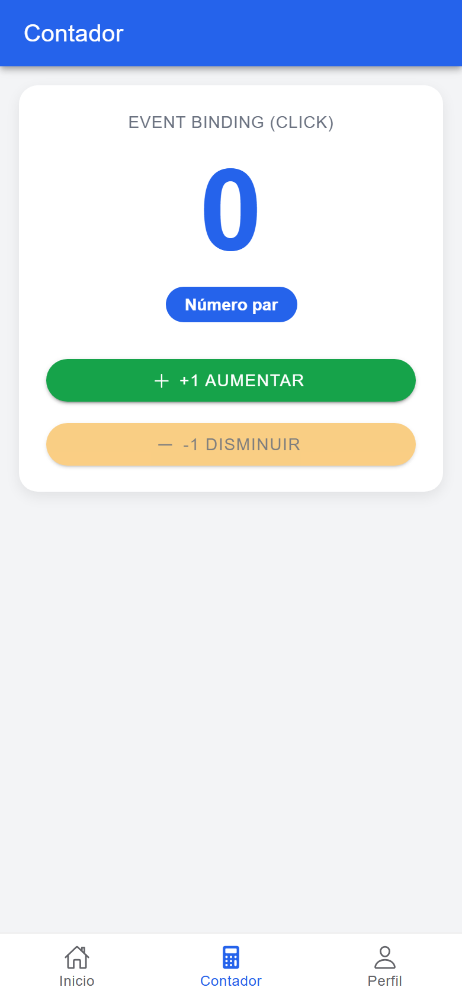
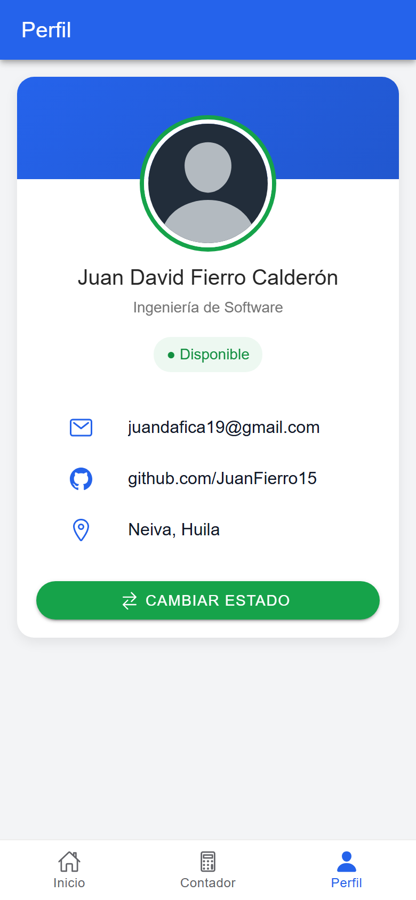

# appPestanas


Aplicación híbrida de tres pestañas hecha con Ionic, Angular y TypeScript. Es el laboratorio de la semana 8 de **Desarrollo de Dispositivos Móviles** (Ingeniería de Software, Universidad Surcolombiana, Neiva) y el primero del curso en desarrollo híbrido, después de los laboratorios en Android nativo con Kotlin.

El objetivo es practicar la navegación por pestañas y el manejo de estado en TypeScript: cada pantalla guarda sus datos como propiedades de la clase y la vista se actualiza sola.

## Capturas

| Inicio | Contador | Perfil |
|---|---|---|
|  |  |  |

## Funcionalidades

### Inicio
- Tarjeta de bienvenida con el nombre completo, la carrera y la universidad del estudiante.
- Los datos viven en variables de `tab1.page.ts` y se muestran con interpolación.

### Contador
- Contador numérico con botones **+1 Aumentar** y **-1 Disminuir**.
- El valor nunca baja de cero: la validación está en el método `decrease()` y el botón se deshabilita cuando el contador está en 0.

### Perfil
- Tarjeta de presentación con avatar, nombre, carrera y datos de contacto (correo, GitHub y ciudad).
- Estado **Disponible** u **Ocupado** con color reactivo (verde o rojo) que se alterna con el botón **Cambiar estado**.

## Conceptos aplicados

- **Interpolación** `{{ variable }}`: muestra en el HTML el valor de una propiedad de TypeScript.
- **Enlace de eventos** `(click)="metodo()"`: ejecuta un método de la clase cuando el usuario pulsa un botón.
- **Enlace de propiedades** `[color]="isAvailable ? 'success' : 'danger'"`: asigna una expresión a una propiedad de un componente de Ionic.
- **Navegación por pestañas con lazy loading**: `tabs.routes.ts` define rutas hijas con `loadComponent`, así el código de cada pestaña se descarga solo cuando se abre.
- **Componentes standalone**: cada página declara en `imports` los componentes de Ionic que usa.

## Stack

- Ionic 9
- Angular 22
- TypeScript 6
- Capacitor 8
- ionicons

## Estructura del proyecto

```
src/app/
├── app.component.ts
├── app.routes.ts
├── tabs/
│   ├── tabs.page.ts
│   ├── tabs.page.html
│   └── tabs.routes.ts
├── tab1/
│   ├── tab1.page.ts
│   ├── tab1.page.html
│   └── tab1.page.scss
├── tab2/
│   ├── tab2.page.ts
│   ├── tab2.page.html
│   └── tab2.page.scss
└── tab3/
    ├── tab3.page.ts
    ├── tab3.page.html
    └── tab3.page.scss
```

## Cómo ejecutarlo

Requisitos: Node.js y Ionic CLI (`npm install -g @ionic/cli`).

```bash
git clone https://github.com/JuanFierro15/app-pestanas-ionic.git
cd app-pestanas-ionic
npm install
ionic serve
```

La aplicación se abre en `http://localhost:8100`. Para verla como en un teléfono, abre las herramientas de desarrollo del navegador (F12) y activa la barra de dispositivo (Ctrl+Shift+M).

## Autor

**Juan David Fierro Calderón**
Ingeniería de Software, Universidad Surcolombiana, Neiva

- GitHub: [JuanFierro15](https://github.com/JuanFierro15)
- Correo: juandafica19@gmail.com
